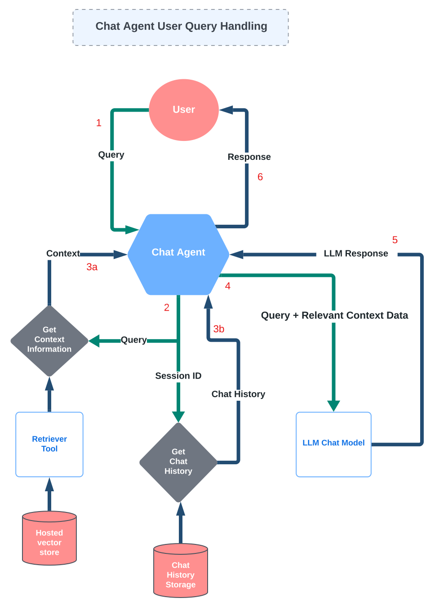
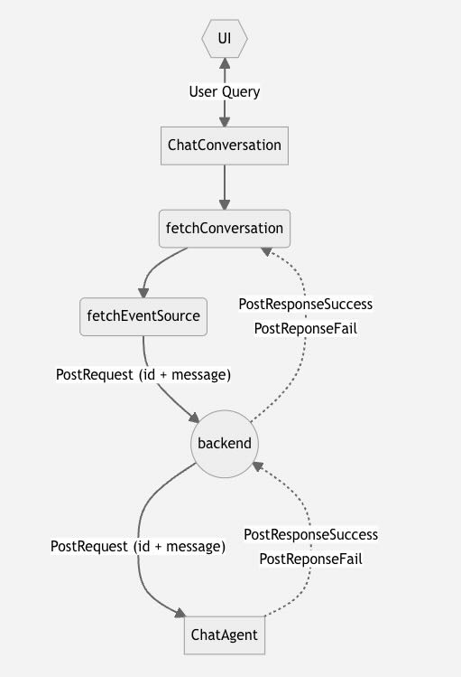

# AI Student Advisor - AI Component

The AI component of the AI Student Advisor is responsible for providing the chat engine with the ability to answer questions based on the data and remember conversation history.

## Primary Stages

- **Data Loading:** Ingest data, generate embeddings using LLM model, and store in a hosted vector database
- **Context Retrieval:** Retieve relevant context from vector database based on user query
- **Response Generation:** Generate response based on user query, retrieved context and previous conversation history

  
source: [LangChain - Retrieval](https://python.langchain.com/docs/modules/data_connection/)

## Components Required for Chat Agent

- **Retrieve & Load Data:** Use data loaders to create a retrieval tool for the chat engine
- **Embedding Generation:** Generate embeddings for the source data using the configured embedding model
- **Chat Agent Instantiation**: Create a chat agent that can answer questions based on the data & remember conversation history

## User Query Handling Workflow

## API

### User Query Handling

