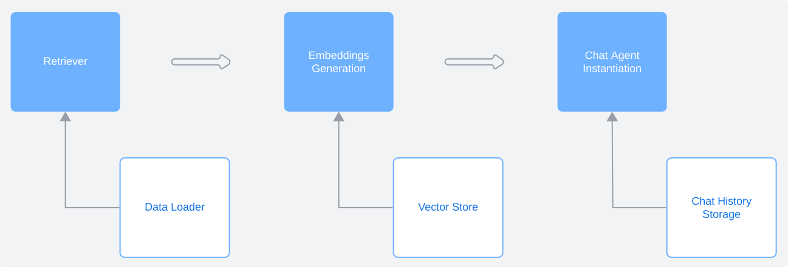
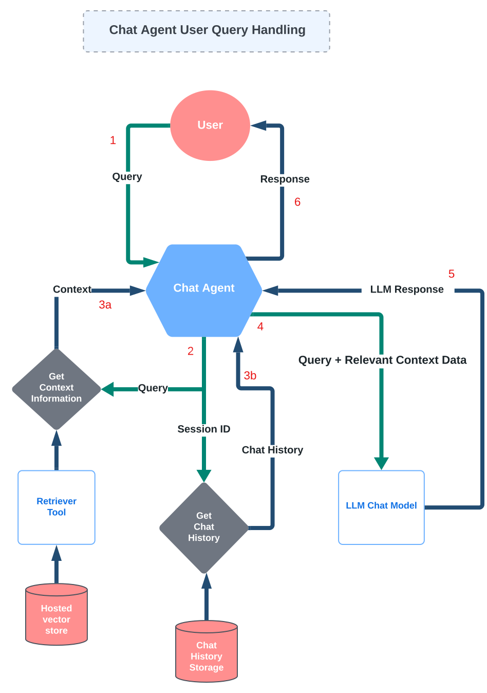

# Documentation for the AI Component of the AI Student Advisor App

## Primary Components

- **Retrieve & Load Data:** Use data loaders to create a retrieval tool for the chat engine
- **Embedding Generation:** Generate embeddings for the source data using the configured embedding model
- **Chat Agent Instantiation**: Create a chat agent that can answer questions based on the data & remember conversation history

## Chat Agent Creation

Overall main components:

### User Query Handling Workflow

